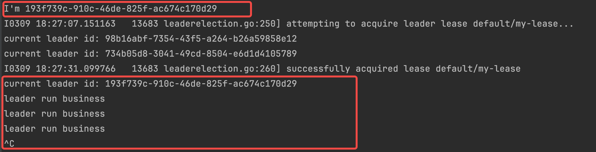

<!-- toc -->
# List-Watch机制
K8s API Server 提供了某类资源CURD的 HTTP 接口，其中获取某类资源集合的 API 被称为 List 接口。例如下面的 URL 可以列出 default namespace 下面的 pods

需要在对应的node上先执行
```shell
$ kubectl proxy
Starting to serve on 127.0.0.1:8001
```
然后再获取相应的资源集合
```shell 
curl -v -X GET http://127.0.0.1:8001/api/v1/namespaces/default/pods
```

在该 URL 后面加上参数 ?watch=true，则 API Server 会对 default namespace 下面的 pod 的状态进行持续监控，并在 pod 状态发生变化时通过 chunked Response (HTTP 1.1) 或者 Server Push（HTTP2）通知到客户端。K8s 称此机制为 watch。

```shell
curl -v -X GET http://127.0.0.1:8001/api/v1/namespaces/default/pods?watch=True
```



# chunked Response实现示例
server demo 
```golang
package main

import (
	"net/http"
	"fmt"
	"time"
)

func heart(w http.ResponseWriter, r *http.Request) {
	defer func() {
		fmt.Println("heart closed")
	}()

	ctx := r.Context() // 获取请求的Context
	w.Header().Set("Transfer-Encoding", "chunked")

	for {
		select {
		case <-time.After(1 * time.Second):
			// 每秒发送一次数据到客户端
			_, err := fmt.Fprintf(w, "data: %v\n", time.Now())
			if err != nil {
				// 如果写入发生错误，比如客户端已断开连接，那么结束循环
				fmt.Println("write err:", err.Error())
				return
			}
			if f, ok := w.(http.Flusher); ok {
				f.Flush() // 发送缓冲区的数据
			}
		case <-ctx.Done():
			// 如果客户端断开连接，Context将被取消(cancel)
			fmt.Println("Client has disconnected:", ctx.Err())
			return // 结束循环，优雅地终止处理函数
		}
	}
}

func main() {
	http.HandleFunc("/heart", heart)         // 设置访问的路由
	err := http.ListenAndServe(":6789", nil) //设置监听的端口
	if err != nil {
		fmt.Errorf("http server error: %s", err)
		return
	}
}
```
Client
```shell
$ curl localhost:6789/heart
data: 2024-03-31 15:41:18.259277 +0800 CST m=+7.257596089
data: 2024-03-31 15:41:19.260029 +0800 CST m=+8.258385217
data: 2024-03-31 15:41:20.260376 +0800 CST m=+9.258767149
data: 2024-03-31 15:41:21.261619 +0800 CST m=+10.260046307
data: 2024-03-31 15:41:22.261765 +0800 CST m=+11.260227495
data: 2024-03-31 15:41:23.262878 +0800 CST m=+12.261376181
^C
```
Server
```shell
Client has disconnected: context canceled
heart closed
```
# 参考
- [Kubernetes Controller 机制详解（一）](https://www.zhaohuabing.com/post/2023-03-09-how-to-create-a-k8s-controller/)
- [k8s api reference](https://kubernetes.io/docs/reference/generated/kubernetes-api/v1.26/)