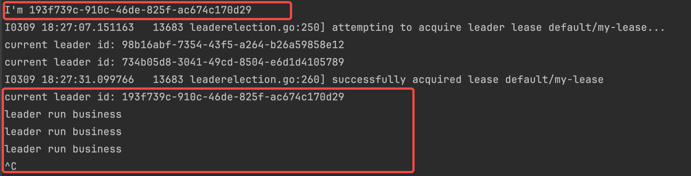
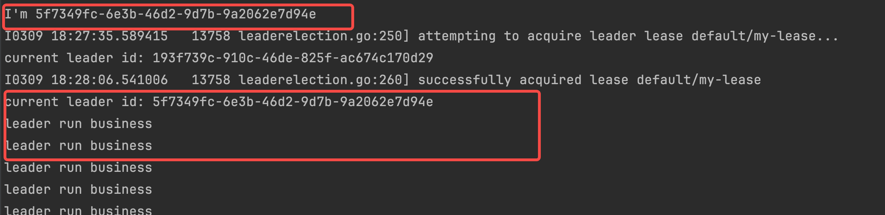
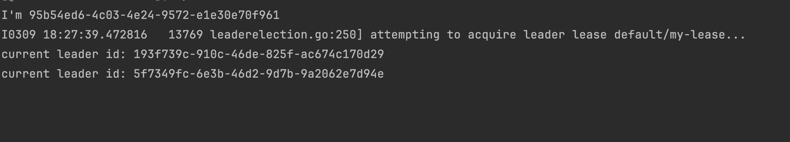

<!-- toc -->
本文主要从工程角度介绍两种选主方式:
- Sidercar部署：不侵入业务，利用现有轮子
- 嵌入业务代码：对于业务有侵入，好在可控性强

关于原理方面的介绍，可以参考[基于Kubernetes选主及应用](https://qiankunli.github.io/2021/01/13/kubernetes_leader_election.html)
# Sidercar部署
```yaml
apiVersion: apps/v1
kind: Deployment
metadata:
  name: nginx-deploy
  labels:
    app: nginx-deploy
spec:
  replicas: 2
  selector:
    matchLabels: &labels
      app: nginx-deploy
  template:
    metadata:
      labels: *labels
    spec:
      containers:
      - args:
        - --election=elect-nginx-deploy
        - --http=0.0.0.0:4444
        image: k8s.gcr.io/leader-elector:0.5
        imagePullPolicy: IfNotPresent
        name: leader-elector
      - name: nginx-deploy
        image: nginx
        imagePullPolicy: IfNotPresent
        ports:
          - containerPort: 9898  #这里containerPort是容器内部的port, 只能在容器内部访问
```
报错如下
```
$ kubectl logs pod/nginx-deploy-84464d8b45-hnfzf -n test-leader-elector
Defaulted container "leader-elector" out of: leader-elector, nginx-deploy
F0303 14:30:00.130485       8 main.go:108] failed to create election: endpoints "elect-nginx-deploy" is forbidden: User "system:serviceaccount:test-leader-elector:default" cannot get resource "endpoints" in API group "" in the namespace "default"
```
修复
<p style="padding: 10px; border-left: 8px solid #dddfe4;
display: block;
padding: 16px;
margin: 0 0 24px;
border-left: 8px solid #dddfe4;
background: #eef0f4;
overflow: auto;
word-break: break-word !important;
">
由于这里给了最高admin的权限，不建议在生产环境使用
</p> 

```yaml
# NOTE: The service account `default:default` already exists in k8s cluster.
# You can create a new account following like this:
#---
#apiVersion: v1
#kind: ServiceAccount
#metadata:
#  name: <new-account-name>
#  namespace: <namespace>

---
apiVersion: rbac.authorization.k8s.io/v1
kind: ClusterRoleBinding
metadata:
  name: fabric8-rbac
subjects:
  - kind: ServiceAccount
    # Reference to upper's `metadata.name`
    name: default
    # Reference to upper's `metadata.namespace`
    namespace: default
roleRef:
  kind: ClusterRole
  name: cluster-admin
  apiGroup: rbac.authorization.k8s.io
```
验证如下：
```shell
$ kubectl get pod
NAME                                  READY   STATUS    RESTARTS      AGE
nginx-deploy-5ff9c9d8c7-grsfh         2/2     Running   0             110s
nginx-deploy-5ff9c9d8c7-hcbct         2/2     Running   0             111s

$ kubectl logs pod/nginx-deploy-5ff9c9d8c7-grsfh
Defaulted container "leader-elector" out of: leader-elector, nginx-deploy
nginx-deploy-5ff9c9d8c7-hcbct is the leader
I0303 14:39:10.661727       8 leaderelection.go:296] lock is held by nginx-deploy-5ff9c9d8c7-hcbct and has not yet expired
```
可以看到当前的主是nginx-deploy-5ff9c9d8c7-hcbct
接下来，我们将主pod杀掉，看是否会切换主：
```shell
$ kubectl delete pod/nginx-deploy-5ff9c9d8c7-hcbct
pod "nginx-deploy-5ff9c9d8c7-hcbct" deleted

$ kubectl logs pod/nginx-deploy-5ff9c9d8c7-jpqb8
I0303 14:48:04.285958       9 leaderelection.go:296] lock is held by nginx-deploy-5ff9c9d8c7-hcbct and has not yet expired
E0303 14:48:08.339644       9 event.go:257] Could not construct reference to: '&api.Endpoints{TypeMeta:unversioned.TypeMeta{Kind:"", APIVersion:""}, ObjectMeta:api.ObjectMeta{Name:"elect-nginx-deploy", GenerateName:"", Namespace:"default", SelfLink:"", UID:"34bd01ff-be9e-402b-bc46-39c1be5720ba", ResourceVersion:"1843444", Generation:0, CreationTimestamp:unversioned.Time{Time:time.Time{sec:63845073549, nsec:0, loc:(*time.Location)(0x240f0a0)}}, DeletionTimestamp:(*unversioned.Time)(nil), DeletionGracePeriodSeconds:(*int64)(nil), Labels:map[string]string(nil), Annotations:map[string]string{"control-plane.alpha.kubernetes.io/leader":"{\"holderIdentity\":\"nginx-deploy-5ff9c9d8c7-hcbct\",\"leaseDurationSeconds\":10,\"acquireTime\":\"2024-03-03T14:39:09Z\",\"renewTime\":\"2024-03-03T14:47:23Z\",\"leaderTransitions\":0}"}, OwnerReferences:[]api.OwnerReference(nil), Finalizers:[]string(nil)}, Subsets:[]api.EndpointSubset(nil)}' due to: 'selfLink was empty, can't make reference'. Will not report event: 'Normal' '%v became leader' 'nginx-deploy-5ff9c9d8c7-jpqb8'
nginx-deploy-5ff9c9d8c7-jpqb8 is the leader
I0303 14:48:08.339800       9 leaderelection.go:215] sucessfully acquired lease default/elect-nginx-deploy
```

# 嵌入选主代码

示例代码如下：
```golang
/*
Copyright 2016 The Kubernetes Authors.

Licensed under the Apache License, Version 2.0 (the "License");
you may not use this file except in compliance with the License.
You may obtain a copy of the License at

    http://www.apache.org/licenses/LICENSE-2.0

Unless required by applicable law or agreed to in writing, software
distributed under the License is distributed on an "AS IS" BASIS,
WITHOUT WARRANTIES OR CONDITIONS OF ANY KIND, either express or implied.
See the License for the specific language governing permissions and
limitations under the License.
*/

// Note: the example only works with the code within the same release/branch.
package main

import (
	"context"
	"time"

	"fmt"

	"github.com/google/uuid"
	metav1 "k8s.io/apimachinery/pkg/apis/meta/v1"
	"k8s.io/client-go/kubernetes"
	"k8s.io/client-go/tools/clientcmd"
	"k8s.io/client-go/tools/leaderelection"
	"k8s.io/client-go/tools/leaderelection/resourcelock"
	"k8s.io/utils/pointer"
)

func main() {
	// 当前进程身份
	processIdentify := uuid.New().String()
	fmt.Println("I'm " + processIdentify)

	var kubeconfig *string
  // 替换自己的kubeconfig路径
	kubeconfig = pointer.String("./kube/config")

	// use the current context in kubeconfig
	config, err := clientcmd.BuildConfigFromFlags("", *kubeconfig)
	if err != nil {
		panic(err.Error())
	}

	// create the clientset
	clientset, err := kubernetes.NewForConfig(config)
	if err != nil {
		panic(err.Error())
	}

	// 配置 Lease 参数
	leaseLock := &resourcelock.LeaseLock{
		LeaseMeta: metav1.ObjectMeta{
			Name:      "my-lease",
			Namespace: "default",
		},
		Client: clientset.CoordinationV1(),
		LockConfig: resourcelock.ResourceLockConfig{
			Identity: processIdentify,
		},
	}

	// 配置 Leader Election
	leaderElectionConfig := leaderelection.LeaderElectionConfig{
		Lock:          leaseLock,
		LeaseDuration: 15 * time.Second,
		RenewDeadline: 10 * time.Second,
		RetryPeriod:   2 * time.Second,
		Callbacks: leaderelection.LeaderCallbacks{
			OnStartedLeading: func(ctx context.Context) {
				// 当前实例成为 Leader
				// 在这里执行 Leader 专属的逻辑
				for {
					time.Sleep(5 * time.Second)
					fmt.Println("leader run business")
				}
			},
			OnStoppedLeading: func() {
				fmt.Println("leader stopped")
			},
			OnNewLeader: func(identity string) {
				// 有新的 Leader 产生
				fmt.Printf("current leader id: %s\n", identity)
			},
		},
	}

	leaderElector, err := leaderelection.NewLeaderElector(leaderElectionConfig)
	if err != nil {
		panic(err.Error())
	}

	// 开始 Leader Election
	ctx := context.Background()
	leaderElector.Run(ctx)
}
```
编译运行，同时启动三个进程，停止其中一个获取到lease的进程：

另一个进程随即抢到lease

没有获取到lease的会被阻塞住

在集群中我们也可以查看lease的相关信息
```shell
$ kubectl get lease 
NAME       HOLDER                                 AGE
my-lease   5f7349fc-6e3b-46d2-9d7b-9a2062e7d94e   20m
$ kubectl get lease/my-lease -o yaml
apiVersion: coordination.k8s.io/v1
kind: Lease
metadata:
  creationTimestamp: "2024-03-09T10:13:24Z"
  name: my-lease
  namespace: default
  resourceVersion: "281984532"
  uid: c23ee08c-de1d-4254-9c13-1a6c7d25ba87
spec:
  acquireTime: "2024-03-09T10:28:06.504283Z"
  holderIdentity: 5f7349fc-6e3b-46d2-9d7b-9a2062e7d94e # 这里可以看到是哪个实例是leader
  leaseDurationSeconds: 15
  leaseTransitions: 5
  renewTime: "2024-03-09T10:33:29.498343Z"
```